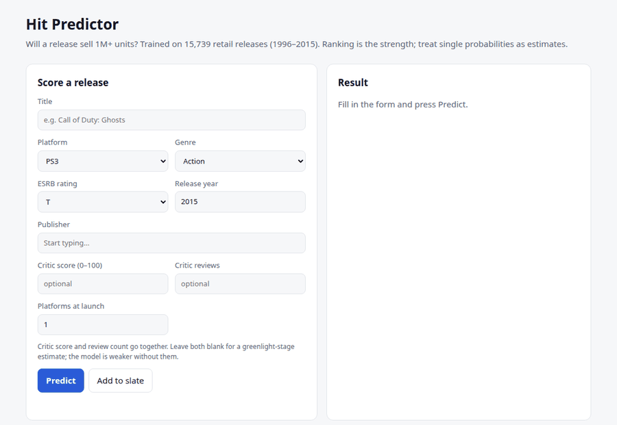
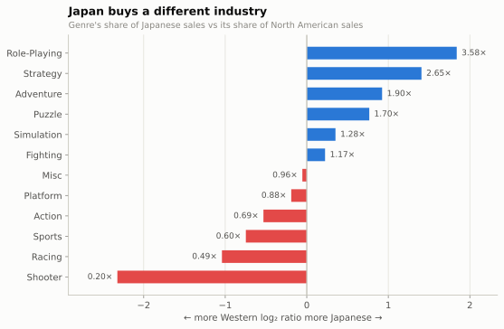
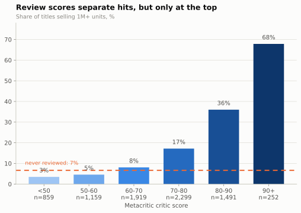

# Video Game Market Intelligence

[](https://github.com/jayraj0975/video-game-market-intelligence/actions/workflows/ci.yml)

Two questions about the video game industry, answered from 15,739 platform
releases between 1996 and 2016:

1. **Where is the money, and who is buying what?** A market analysis of genre
   share, regional taste, console life cycles and publisher concentration.
2. **Can you call a hit before it ships?** A classifier that ranks a release
   slate by the probability each title clears one million units, using what is
   known shortly before release: platform, genre, rating, publisher and franchise
   track record, launch scale and, when available, early critic reviews.

The short answer to the second question: **yes, partially.** Ranking the
2014-15 slate and funding the top 10% captures **56% of the actual
million-sellers** — a **5.6× lift** (95% interval 5.0-6.3×) over picking at random. That is useful and
it is nowhere near clairvoyance, and this repo is careful about the difference.

> **Decision point: pre-release (near-launch), not greenlight.** Critic score and review count only exist within days
> of launch, so the headline numbers describe a forecast made close to release. A model with the critic features
> removed is the closer answer to "could this be called at greenlight?": it captures **47%** of the hits at the same 10%
> budget (**4.7× lift**, PR-AUC 0.578 against 0.674). The web app and API say which case a prediction is, and whether
> critic data was used.

**Live demo:** [video-game-hit-predictor-sr-45ad.vercel.app](https://video-game-hit-predictor-sr-45ad.vercel.app) ·
**Reports:** [Market findings](reports/market_findings.md) ·
[Model report](reports/model_report.md)

---



## Headline findings

### Japan buys a different industry

The sharpest divide in the data. Role-playing games take **29.5%** of Japanese
sales against **8.2%** of North American. Shooters run the other way and harder:
**13.3%** of NA sales, **2.7%** of JP — a **5× gap in the opposite direction**.



A publisher treating "global" as one market with one genre strategy is getting
one of those two regions wrong.

### Being reviewed widely beats being reviewed well

The strongest single predictor of a million-seller is not the critic score —
it is **how many critics bothered to review it**, which scores roughly **5×**
the importance of the score itself. Press volume tracks marketing spend and
distribution reach. Quality matters; prominence matters more.

The score is not useless, but its power is concentrated at the top: **68%** of
90+ titles are million-sellers against **3%** of sub-50 titles, and between 50
and 70 the score barely moves the odds at all.



### The tracked market peaked in 2008 and halved

672M units in 2008, 268M by 2015 — a **60% decline**, with release counts
falling alongside. The caveat is load-bearing: this data covers physical retail
only, and the decline overlaps exactly with the shift to digital. Some of this
is a real contraction and some is the measuring instrument losing sight of the
market. Nothing in the data separates the two, and the report says so rather
than picking the more dramatic reading.

---

## The model

**Task.** Predict whether a release will sell 1M+ units, from platform, genre,
ESRB rating, publisher and franchise track record, release scale, and early
critic reception. Because critic reception only exists close to launch, this is
a **pre-release (near-launch)** forecast; see the ablation below for the version
without it.

**Test protocol.** Train on 1996-2013, test on the 2014-15 slate. Evaluated on
precision-recall, not accuracy — hits are 12% of releases, so "predict no
every time" scores 88% accuracy and is worth nothing.

| Model | ROC-AUC | PR-AUC | Precision@10% | Recall@10% | Lift |
|---|---|---|---|---|---|
| Base rate | 0.500 | 0.119 | 0.084 | 0.071 | 0.7× |
| **Logistic regression** | 0.902 | **0.674** | **0.664** | **0.560** | **5.6×** |
| Gradient boosting | 0.905 | 0.629 | 0.605 | 0.511 | 5.1× |

Logistic regression edges gradient boosting on the metric that matters here, but
the test slate holds only 141 hits, so treat the two as a tie. Resampling the
slate 2,000 times puts the logistic model's PR-AUC at **0.60-0.74** and its lift
at **5.0-6.3×**; the PR-AUC gap to gradient boosting has a 95% interval of
**-0.005 to +0.096**, which includes zero. The simpler model is the pick for
simplicity, not because it is proven better. Every number is reported as it came
out rather than tuned until the fancier model won.


### Three things this repo does that a hit-prediction notebook usually doesn't

**It refuses the obvious leakage, then measures it.** The regional sales
columns sum to the target, so they never enter the feature matrix. Track-record
features ("how many hits has this publisher had") are computed from *strictly
earlier release years*, expanding forward, so a 2004 row cannot learn from
2012. And there is a worked demonstration of what leakage buys you: adding
Metacritic's user review count — a number that only exists after people have
bought the game — lifts PR-AUC from **0.674 to 0.739**, with no error message
and nothing that looks wrong on the page.

**It ablates its own weakest assumption.** Critic scores arrive at launch, not
at greenlight, so they are the least defensible feature in the set. Removed
entirely, PR-AUC falls to **0.578** — still 4.9× the no-skill floor. The model
is not just a repackaging of Metacritic.

**It separates good rankings from honest probabilities.** `class_weight=
"balanced"` produces a well-ordered slate and wildly overconfident numbers.
Isotonic calibration fixes the probabilities without touching the order: Brier
**0.104 → 0.064**, every decision metric unchanged.


---

## Try it: web app

Deployed on Vercel from this repo; every push to `main` redeploys it. The served
model is committed at `app/model/serving_model.joblib` (rebuild it with
`python -m app.service`), so the deployment needs neither the dataset nor a
training step.

A FastAPI backend serves the same calibrated model the report evaluates, with a
single-page frontend on top: score one release, rank a whole slate, and browse
the market charts.

```bash
pip install -r requirements-dev.txt
./run_all.sh                       # fetches data and builds reports (once)
uvicorn app.main:app --reload      # http://127.0.0.1:8000
```

| Endpoint | Purpose |
|---|---|
| `POST /api/predict` | probability that one release sells 1M+ units |
| `POST /api/rank` | rank up to 50 releases by that probability |
| `GET /api/options` | valid platforms, genres, ratings, publishers |
| `GET /api/metrics` | test-slate metrics and bootstrap intervals |
| `GET /api/model-info` | what is being served: model version, decision point, training and evaluation windows, code commit, data and artifact SHA-256, library versions |
| `GET /api/market` | chart data for the dashboard |

Interactive API docs live at `/docs`. Or run it in Docker:
`docker build -t hit-predictor . && docker run -p 8000:8000 hit-predictor`.

Probabilities are clipped to 0.5%-98%: isotonic calibration saturates at exactly
0 and 1, which is a step-function artefact rather than certainty. Score *new*
releases; a game already in the dataset counts itself in its own franchise
history. Publisher and franchise track records are built from releases through
2015, so they are only a valid input for a release **after** 2015: a request dated
2015 or earlier is answered but flagged (`history_note`) as not a valid historical
backtest, because the model would be seeing its own future.

**Provenance.** `app/model/serving_model.meta.json` sits beside the committed model and records its version, the
code commit that built it, the SHA-256 of the raw and cleaned data and of the model file, the feature-schema hash, the
1996-2013 training and 2014-2015 evaluation windows, and library versions. A test checks the file against the artifact,
so the two cannot drift. Rebuild both with `python -m app.service`.

## Running it

```bash
pip install -r requirements-dev.txt   # or requirements-lock.txt for the exact tested versions
./run_all.sh
pip install pytest && pytest      # leakage, provenance and API tests; they need no dataset and no network
```

Pull-request CI runs those offline tests only. A separate scheduled workflow (`reproduce.yml`) downloads the data, checks the
cleaned file against its pinned SHA-256, retrains, and fails if the committed metrics no longer reproduce, so an outage at a
data mirror cannot fail a commit.

That fetches the dataset, cleans it, and regenerates every figure and both
reports — roughly a minute end to end. The numbers quoted in the reports are
rendered from the same computation that draws the charts, so they cannot drift
out of sync with the code.

```
app/                 FastAPI backend (service.py, main.py) and the static frontend
src/
  config.py          paths, and the definitions of "hit" and the train/test boundary
  download_data.py   fetch the source dataset into data/
  data_prep.py       cleaning, target construction, the derived title features
  features.py        feature engineering, including the leak-free track records
  eda.py             six market analyses -> six figures + market_findings.md
  train.py           models, evaluation, ablation, leakage check -> model_report.md
  viz_style.py       shared chart theme
tests/               leakage, split and metric tests
reports/
  market_findings.md
  model_report.md
  metrics.json       every number above, machine-readable
  figures/
```

## Data

VGChartz sales scrape joined to Metacritic scores, published on Kaggle as
*Video Game Sales with Ratings*. 16,719 raw rows; 15,739 survive cleaning
(1996-2016, valid genre and release year). It is fetched by
`src/download_data.py` rather than committed, so `data/` starts empty.

Three known problems in the raw file, all handled in `data_prep.py` rather than
ignored:

- `User_Score` is stored as text because Metacritic writes `tbd` below a review
  threshold.
- Release years contain stray errors — one Nintendo DS title is dated 1985 —
  which is why platform debut years come from the first year with a real
  release slate rather than a plain `min()`.
- Half the rows have no critic score, and the missingness is not random:
  obscure titles go unreviewed. It is kept as an explicit feature instead of
  being imputed away.

The 2016 snapshot is a partial year. It is shaded in every time-series chart
and excluded from model evaluation.

## What this can't tell you

Physical retail only — no digital, mobile or free-to-play. "Hit" means "retail
hit". The 1M threshold is the industry's own shorthand, not a natural break in
the distribution; moving it moves every number here. And the publisher
track-record features carry survivorship bias, since a publisher only has a
track record if it lasted long enough to build one.

The full list is at the bottom of the [model report](reports/model_report.md).

## Related

The same habits (leak-free evaluation, calibration, stated uncertainty) run through my churn work: [`customer-churn-analysis`](https://github.com/jayraj0975/customer-churn-analysis) (analysis), [`churnapp`](https://github.com/jayraj0975/churnapp) (web app) and [`churn-predictor-android`](https://github.com/jayraj0975/churn-predictor-android).

## License

MIT
