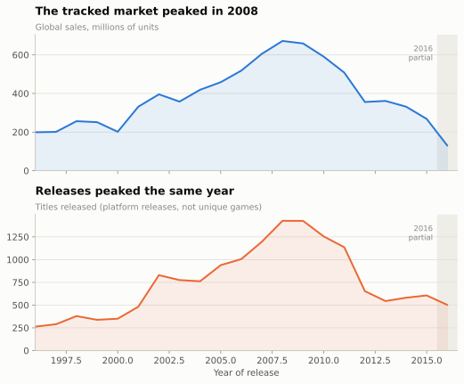
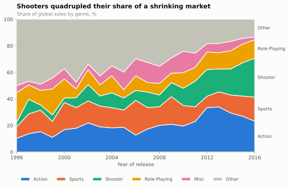
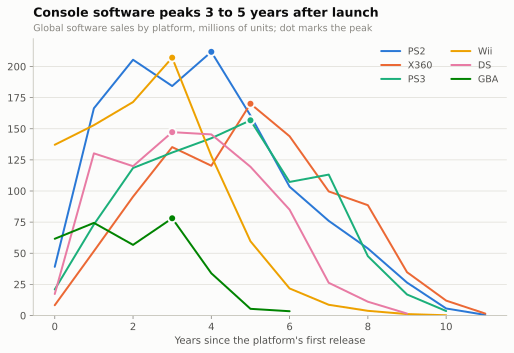
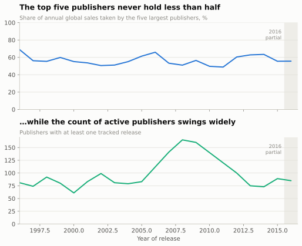

# Market findings

Generated by `src/eda.py` from 15,739 platform releases
(10,824 unique titles), 1996-2016.
Every number below is computed at render time; none are typed by hand.

> **On 2016.** The snapshot was taken in December 2016, so that year's titles
> had not finished selling. 2016 appears in the charts with a shaded band and
> is excluded from model evaluation.

---

## 1. The market peaked in 2008 and has not recovered

Tracked sales peaked at **672M units** in 2008 and fell to
**268M** by 2015 -- a **60% decline**. Release counts
fell alongside, so this is a market contracting rather than the same demand
spread over more titles.

The honest caveat: this dataset tracks physical retail sales. The decline
overlaps with the rise of digital distribution and free-to-play, so some of
this is a measurement shift, not only a market one. Nothing in the data can
separate the two, and any conclusion that ignores that is overclaiming.

## 2. Shooters quadrupled their share as the market shrank

Shooters grew from **5.3%** of sales in 1996-2000 to
**22.9%** in 2013-2016 -- a
4.3× increase in share
while the market itself contracted. The genres holding the most lifetime revenue
are Action, Sports, Shooter, Role-Playing, Misc.

## 3. Japan buys a different industry

The sharpest divide in the data, and the one with the clearest commercial
consequence.

| Genre | Share of JP sales | Share of NA sales | Ratio |
|---|---|---|---|
| Role-Playing | 29.5% | 8.2% | **3.58×** |
| Shooter | 2.7% | 13.3% | **0.20×** |

Role-playing games take **29%** of the Japanese market against
**8%** of the North American one. Shooters run the other way by
an even wider margin: **13%** of NA sales, **2.7%** of JP.

A publisher treating "global" as one market with one genre strategy is
getting one of these two regions wrong.

## 4. Console software peaks 3 to 5 years after launch

Peak year by platform: Wii (year 3), DS (year 3), GBA (year 3), PS2 (year 4), X360 (year 5), PS3 (year 5). Restricted to platforms that launched
inside the analysis window -- the PlayStation and N64 sold their first years
before 1996, so including them would fake an early peak.

The practical read: a title shipping into a platform's first year competes
for a small installed base, and one shipping in year six is fighting the
next generation's launch window.

## 5. Review scores separate hits only at the very top

Critic score correlates with log sales at **r = 0.38** -- real, but
far from deterministic. The relationship is strongly non-linear:

- 90+ scored titles: **68%** are million-sellers
- Sub-50 titles: **3%**
- Never reviewed (49% of all releases): **7%**

Most of the discriminating power sits in the top two bands. Between 50 and 70
the score barely moves the odds, which is a useful negative result: a mid-range
review tells a publisher almost nothing.

## 6. The top five publishers never hold less than half

Top-5 share of annual sales ranges from **49%** to
**69%**. Over the full period the five largest publishers
account for **53%** of all tracked sales.

