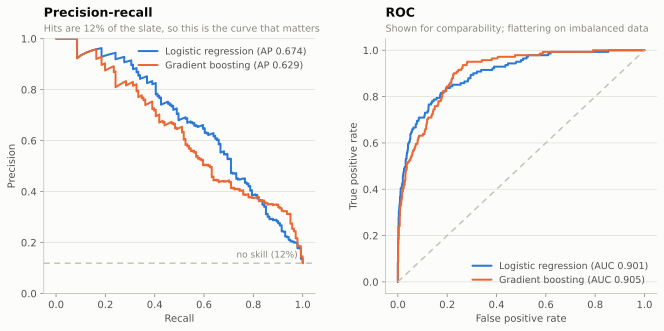
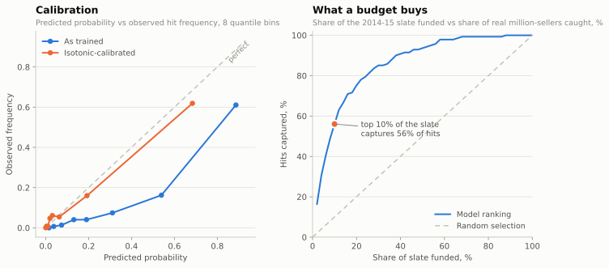
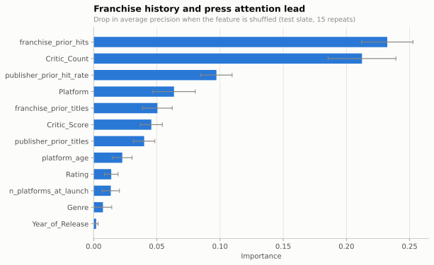

# Model report

Generated by `src/train.py`.

**Task.** Given only what is knowable before release, predict whether a title
will sell 1M+ units.

**Split.** Train on 1996-2013 (14,050 releases), test on
2014-2015 (1,187 releases). Base rate in the test
slate: **11.9%**.

---

## Results

| Model               |   ROC-AUC |   PR-AUC |   Brier |   Precision@10% |   Recall@10% |   Lift |
|:--------------------|----------:|---------:|--------:|----------------:|-------------:|-------:|
| Base rate           |     0.500 |    0.119 |   0.105 |           0.084 |        0.071 |  0.707 |
| Logistic regression |     0.901 |    0.674 |   0.105 |           0.664 |        0.560 |  5.589 |
| Gradient boosting   |     0.905 |    0.629 |   0.068 |           0.613 |        0.518 |  5.164 |

*Lift is precision in the top 10% divided by the base rate: how many times better
than picking at random.*

The best model by PR-AUC is **Logistic regression** at **0.674**, against a
no-skill floor of 0.119. ROC-AUC of 0.901 looks more impressive
than the model is; on a slate that is 12% hits, PR-AUC is the honest number.

## What it buys

Ranking the 1,187-title slate and funding the top 10% -- 119
titles -- captures **79 of the 141 actual
million-sellers**, or **56%**. Picking 10% at random would have
returned about 14. That is a
**5.6× lift**, with 66% of the funded titles
turning out to be hits.

## The probabilities needed fixing; the ranking did not

The left panel above shows the model as trained sitting well below the diagonal
at every point: it consistently claims a far higher chance than the observed
frequency. That is not a bug, it is the direct consequence of
`class_weight="balanced"`, which trains as though hits were half the slate. The
scores are good *rankings* and bad *probabilities*.

Isotonic regression fixes it without disturbing the order, so every decision
metric above is untouched while the Brier score falls from **0.1050**
to **0.0640**. The distinction matters in use: "rank the slate" and
"tell me this game's chance of clearing a million units" are different asks, and
only the second one needs the calibrated model.

## What drives it

`franchise_prior_hits`, `Critic_Count`, `publisher_prior_hit_rate`, `Platform`, `franchise_prior_titles`.

Two things stand out.

**Franchise history dominates.** How many hits the series has already produced
matters more than anything intrinsic to the game. The unglamorous truth of the
industry: a sequel to a million-seller is the safest bet on the board.

**How many critics reviewed it beats what they said.** `Critic_Count` scores
roughly 5× the importance of `Critic_Score`.
The count is not a quality measure -- it is a proxy for how much press attention
the title commanded, which tracks marketing spend and distribution. Being
reviewed widely predicts sales better than being reviewed well.

Genre and release year sit near zero. Both matter a great deal to *how much* a
game sells, and almost not at all to *whether* it crosses a million.

## Ablation: the model without the critic features

The critic columns are the least defensible part of the feature set, so here is
what the model is worth with them removed entirely -- track record, platform,
genre, rating and release scale only:

| Model                                          |   PR-AUC |   Recall@10% |
|:-----------------------------------------------|---------:|-------------:|
| Logistic regression (all launch-time features) |    0.674 |        0.560 |
| Logistic regression (no critic features)       |    0.578 |        0.475 |

PR-AUC falls from **0.674** to **0.578**, still
4.9× the no-skill floor of 0.119. The critic
features are doing real work, and the model is not merely a repackaging of them.

## The leakage check

The point of this section is that the inflation is large and produces no error
message. Adding `User_Count` -- the number of Metacritic user reviews, which
only exists *after* people have bought and played the game -- moves PR-AUC from
**0.674** to **0.739**.

| Model                                           |   ROC-AUC |   PR-AUC |
|:------------------------------------------------|----------:|---------:|
| Logistic regression (launch-time features only) |     0.901 |    0.674 |
| Logistic regression (+ post-release User_Count) |     0.917 |    0.739 |

Nothing about that second row looks wrong in isolation. It is a better model by
every metric on the page, and it is worthless, because at greenlight the feature
is a column of nulls. This is the single most common way a portfolio model
reports a score it could never reproduce in use.

## Honest limitations

1. **Physical retail only.** VGChartz tracks boxed sales. Digital, mobile and
   free-to-play are absent, so "hit" here means "retail hit", and the market
   decline in the descriptive analysis is partly a measurement artefact.
2. **Critic features are launch-window, not greenlight.** Review embargoes lift
   within days of release, so `Critic_Score` and `Critic_Count` are knowable at
   launch but not two years earlier when the money is actually committed. They
   are defensible for a launch-window forecast and a stretch for a greenlight
   one. `Critic_Count` in particular keeps accruing for weeks afterwards, so it
   is the feature in this set closest to the leakage line -- which makes its
   high importance score worth reading with suspicion rather than pride.
3. **Survivorship in the publisher features.** A publisher only has a track
   record if it survived long enough to build one.
4. **The threshold is a business choice.** 1M units is the industry's own
   shorthand, not a natural break in the distribution. Moving it moves every
   number here.
